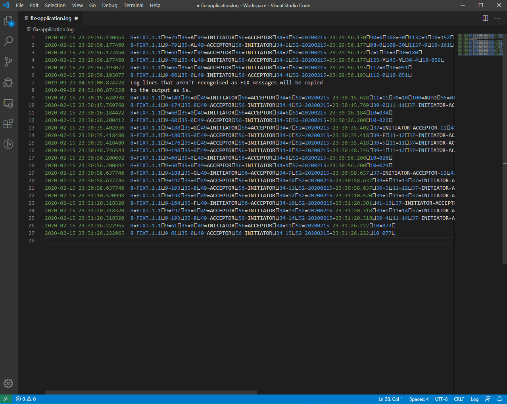
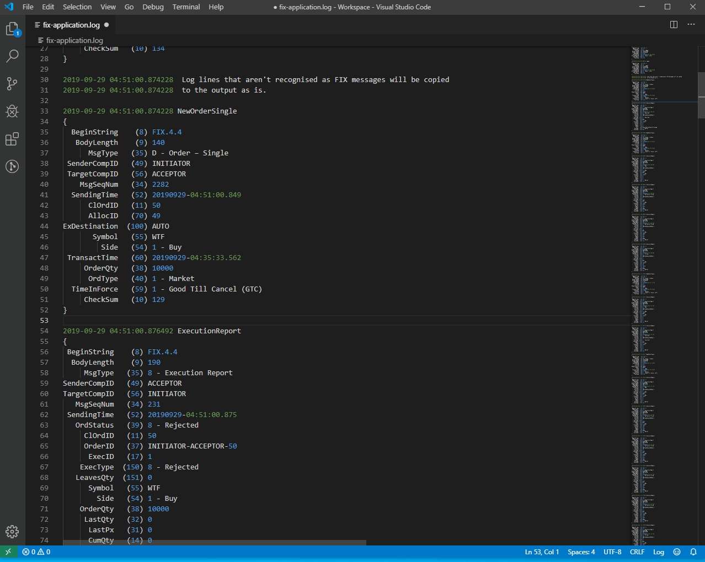

# FIX Master

FIX Master is designed to parse FIX messages from log files and pretty print them in a structured format displaying the names for fields, messages, and enumerated values.

FIX Master contains a rich data dictionary and you can lookup the definition of fields for all known FIX versions.

## Extension Settings

**fixmaster.repositoryPath** Path to a fixtrading.org XML Repository. FIX Master includes a copy of the repository that it will use by default.

**fixmaster.quickFixDataDictionaryPath** Path to a QuickFix XML data dictionary. This can be used to supplement the fixtrading.org repository with custom field definitions.

**fixmaster.nameLookup** `(Strict,Promiscuous)` Governs how names are found for messages, fields, and enumerated values.

**fixmaster.fieldSeparator** The character used to separate fields within a messages. Default is the standard 0x01, some users replace these control characters when logging.

**fixmaster.prefixPattern** Match this pattern in the part of each line preceding the FIX message. This will be included when formatting the FIX message. The default pattern matches a timestamp with the format yyyy-MM-dd HH:mm:ss.ffffff

**fixmaster.administrativeMessageBehaviour** `(IncludeAll,DeleteAll,IgnoreAll,DeleteHeartbeatsAndTestRequests,IgnoreHeartbeatsAndTestRequests)` Control the inclusion and pretty printing of administrative messages.

**fixmaster.nestedFieldIndent** The number of spaces to indent fields belonging to nested groups

**fixmaster.orderBookFields** The fields to display in the order book when pretty printing. These can be field names or tag numbers.

**fixmaster.hoversEnabled** Controls whether hover tooltips are enabled. If true FIX Master will look for a FIX message on the current editor line and pretty print it in a tooltip if found.ß

## Known Issues

This extension is designed to parse FIX application log files which are typically very large, possibly 100s of MB. Visual Studio Code places limits on the size of files it reads so it
doesn't use excessive amounts of memory and negatively affect performance and possibly crash. If a file is over this size which at the time of writing is 50MB, extensions can't see the file. If you have very large files then cut them up into smaller pieces before attempting to format them with FIX Master.

## Acknowledgements

This extension includes parts of the www.fixtrading.org XML Repository Copyright (c) FIX Protocol Ltd. All Rights Reserved.
